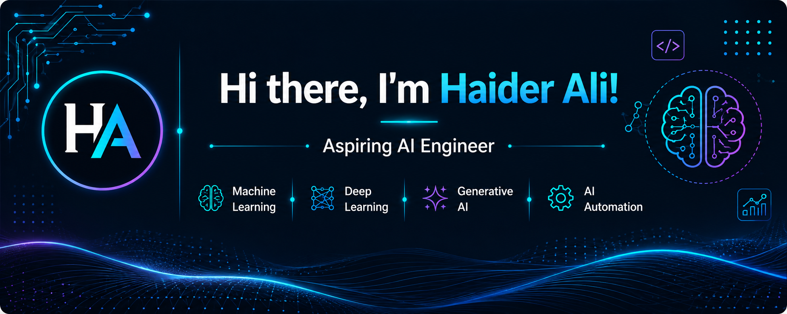

---

## 👨‍💻 About Me

## 👨‍💻 About Me

I'm a BS Information Technology student at **PUCIT Lahore** focused on:

- 🤖 Artificial Intelligence
- 🧠 Machine Learning
- 🧬 Deep Learning
- ✨ Generative AI
- ⚙️ AI Automation
- 🔗 LLM Applications

I build practical AI applications using **Python, Machine Learning,
Deep Learning, LLMs, APIs, Google Gemini, Groq, and Streamlit.**

---

## 🚀 What I Build

| Area | Focus |
|---|---|
| 🤖 Generative AI | LLM-powered applications and AI assistants |
| 🧠 Machine Learning | Prediction systems and ML applications |
| 🧬 Deep Learning | Neural networks and deep learning systems |
| ⚙️ AI Automation | Intelligent agents and automated workflows |
| 🐍 Python | AI and ML application development |

---

## ⭐ Featured Projects

### 💬 AI Chat Assistant

AI-powered conversational assistant built with **Python, Streamlit, and Groq API**.

[🔗 View Repository](https://github.com/haiderali17/AI-Chat-Assistant)  
[🚀 Live Demo](https://ai-chat-assistant-gvpxe6yyaatyqiua8apmuz.streamlit.app/)

### 📄 AI Resume Analyzer

AI-powered resume analyzer built with **Streamlit and Groq Llama 3.3**.

Generates ATS scores, identifies missing skills, and creates professional PDF reports.

[🔗 View Repository](https://github.com/haiderali17/AI-Resume-Analyzer)  
[🚀 Live Demo](https://ai-resume-analyzer-c8behwthbj5pb2hpyaszkc.streamlit.app/)

### 📊 Customer Churn Prediction

Machine Learning-powered customer churn prediction application built with Python and Streamlit.

[🔗 View Repository](https://github.com/haiderali17/Customer-Churn-App)  
[🚀 Live Demo](https://customer-churn-app-vnhfzhu4tgsg4cnsi9ytxd.streamlit.app/)

### 🩺 Disease Prediction ML

Machine Learning project covering data cleaning, EDA, preprocessing, model training, and evaluation.

[🔗 View Repository](https://github.com/haiderali17/Disease-Prediction-ML)  
[🚀 Live Demo](https://diabetes-predictor-ai.streamlit.app/)

### 💻 Laptop Price Prediction

Machine Learning project for predicting laptop prices based on product features.

[🔗 View Repository](https://github.com/haiderali17/Laptop-Price-Prediction)

### 🤖 AI PDF Assistant

AI-powered PDF assistant built with Python and Google Gemini API.

Upload PDFs, ask questions, and receive context-aware answers.

[🔗 View Repository](https://github.com/haiderali17/ai-pdf-assistant)

---

## 🛠️ Tech Stack

### 💻 Languages

### 📊 Data Science & Machine Learning

### 🤖 AI & Generative AI

### 🛠️ Tools

### 🧠 Core Skills

`Machine Learning` • `Deep Learning` • `EDA` • `AI Automation` • `LLM Applications`

---

## 📚 Currently Learning

- Machine Learning
- Deep Learning
- Generative AI
- RAG Systems
- AI Agents
- AI Automation
- LLM Application Development

---

## 🎯 Current Focus

Currently building an **AI Research & Automation Agent** that combines LLMs, tools, APIs, and automated workflows for real-world research tasks.

---

## 🌐 Connect With Me

🌐 [Portfolio](https://haider-ai-portfolio.vercel.app/)

💼 [LinkedIn](https://www.linkedin.com/in/haider-ali-287443322)

🐙 [GitHub](https://github.com/haiderali17)

📧 haiderali6525095@gmail.com
